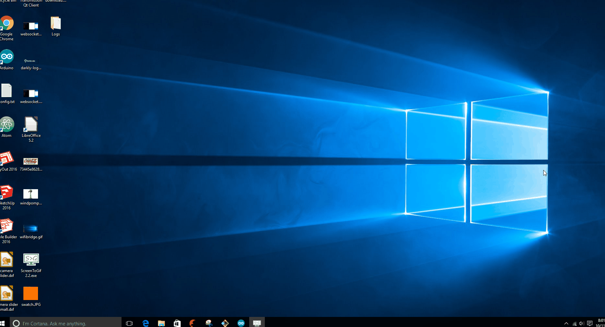

`1.`  Download and install Arduino IDE 1.6.x from https://www.arduino.cc/en/Main/Software

`2.`  Install ESP8266 Arduino support https://github.com/esp8266/Arduino#installing-with-boards-manager

`3.`  Install the following libraries:

`3.1:`  WifiManager: https://github.com/tzapu/WiFiManager#install-through-library-manager

`3.2:`  arduinoWebSockets: https://github.com/Links2004/arduinoWebSockets

`4.` Configure your ESP8266 for sketch upload (GIPOs pulled up and down accordingly, USB to serial connected, reset and ready for upload)

`5.`  Upload the Sketch contained in `websocketserver` folder

`6.`  Connect the TX of the ESP8266 to RX of grbl arduino board, and RX of the ESP8266 to TX. Power up the ESP and engraver
Remember that ESP modules use 3.3v and arduino use 5V. Somewere is suggested to connect via a voltage divider like this:

`7.`  Connect to the ESP8266 WiFi network and go to "http:\\192.168.4.1". Configure connection to your AP, set password, then switch back to your local wifi (Animation below shows the details)

`8.` In LaserGRBL open menu "grbl-settings" and configure for `LaserWebESP8266` protocol and connect to the address of the ESP (usually ws://192.168.x.y:81/ where "x" is your subnet and "y" assigned by DHCP)

NOTE: I will add an IP scanner soon. For now, check on your DHCP server which IP was dished out

NOTE: To reset the Wifi settings you can send `WIFIRESET` via websocket
